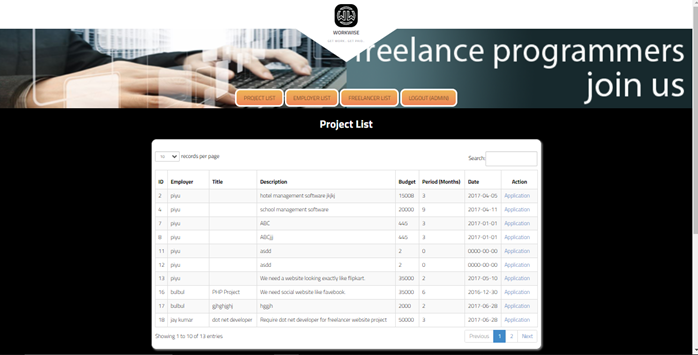
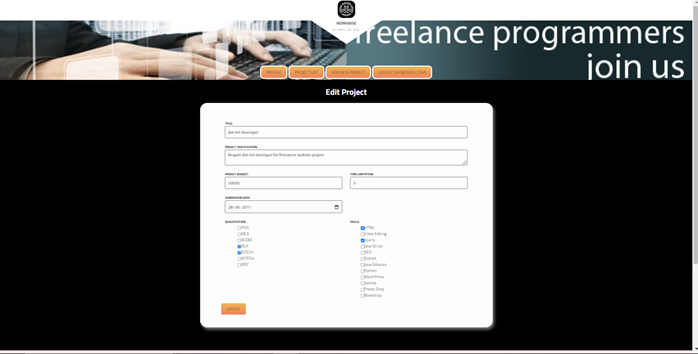
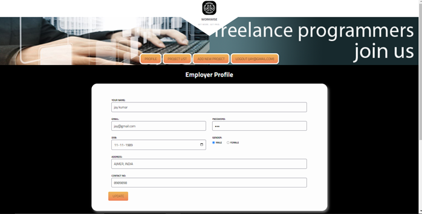
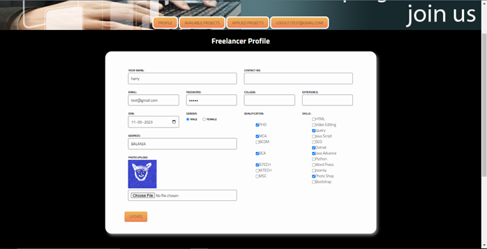
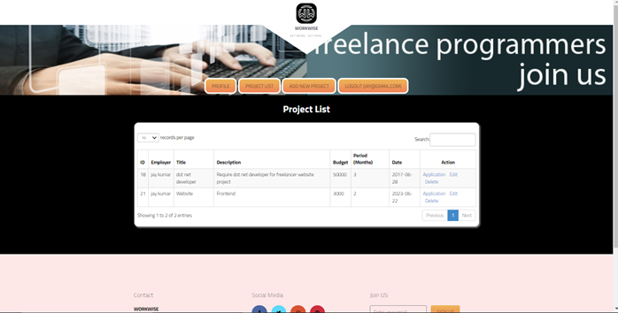

# WorkWise

WorkWise is a web-based platform designed to connect freelancers with clients, providing a user-friendly environment for job postings, applications, and project management. The platform supports communication and collaboration through messaging, file sharing, and other project management tools.

## Features

- **Freelancer Profiles**: Create and manage profiles highlighting skills and experience.
- **Job Postings**: Employers can post jobs and review applications.
- **Project Management**: Tools for managing projects and communication between freelancers and clients.

## Requirements

### Hardware

- RAM: 2GB or above
- Stable Internet Connection

### Software

- Operating System: Windows 10, Linux
- Text Editor: VS Code
- Server: XAMPP
- Browser: Chrome, Mozilla Firefox, etc.
- Database: MySQL

## Languages and Components Used

- **Frontend**: HTML, CSS, JavaScript, Bootstrap, Tailwind CSS
- **Backend**: PHP, JavaScript, SQL

## How to Clone and Use

### Clone the Repository

```bash
git clone https://github.com/yourusername/workwise.git
cd workwise
```








